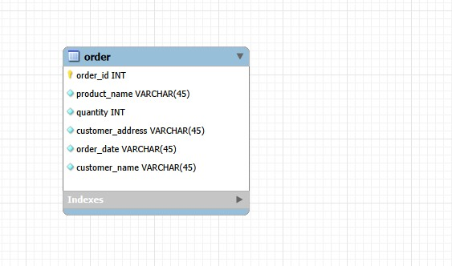
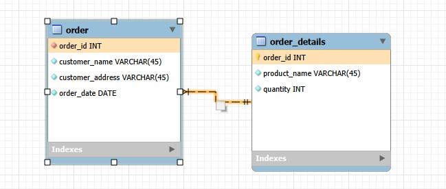
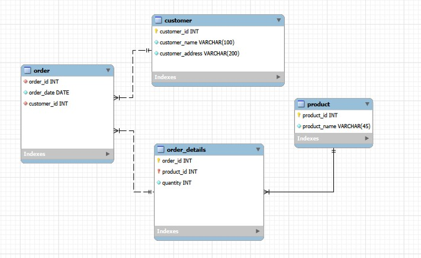

# Database Normalization Project (1NF → 2NF → 3NF)

## 📌 Project Overview

This project demonstrates the step-by-step normalization of a database
schema starting from an unnormalized table and transforming it into:

- First Normal Form (1NF)
- Second Normal Form (2NF)
- Third Normal Form (3NF)

The example models a simple order management system containing:

- Customers
- Orders
- Products
- Order Details

The goal was to eliminate redundancy, remove partial dependencies, and
remove transitive dependencies to achieve a properly structured
relational database.

---

# 🔹 Initial Structure

The original data was stored in a single table containing:

- Order number
- Product names and quantities (stored together in one column)
- Customer address
- Order date
- Customer name

Problems: - Multiple values stored in a single column - Data
redundancy - No proper entity separation

---

# ✅ Step 1 -- First Normal Form (1NF)

**Rule:**\
Each column must contain atomic (single) values.

### What was done:

- Split product list into separate rows
- Ensured each cell contains only one value
- Each product in an order became a separate record

### 1NF Diagram

Result: - Atomic values achieved - Data duplication still exists

---

# ✅ Step 2 -- Second Normal Form (2NF)

**Rule:**\
No partial dependency on a composite primary key.

### Problem identified:

Order details depend on both `order_id` and `product_name`,\
while customer data depends only on `order_id`.

### Solution:

Separated data into two tables:

### Orders

- order_id (PK)
- customer_name
- customer_address
- order_date

### Order_Details

- order_id (PK, FK)
- product_name (PK)
- quantity

Composite Primary Key:

    PRIMARY KEY (order_id, product_name)

### 2NF Diagram

Result: - Removed partial dependencies - Clear separation between orders
and order details

---

# ✅ Step 3 -- Third Normal Form (3NF)

**Rule:**\
No transitive dependencies.

### Problem identified:

`customer_address` depends on `customer_name`,\
which depends on `order_id`.

### Final Solution:

Separated entities into four tables:

### Customers

- customer_id (PK)
- customer_name
- customer_address

### Orders

- order_id (PK)
- order_date
- customer_id (FK)

### Products

- product_id (PK)
- product_name

### Order_Details

- order_id (PK, FK)
- product_id (PK, FK)
- quantity

Composite Key:

    PRIMARY KEY (order_id, product_id)

### 3NF Diagram

Result: - Removed transitive dependencies - Eliminated data redundancy -
Established proper foreign key relationships

---

# 🔗 Relationships

Customers (1) → (N) Orders\
Orders (1) → (N) Order_Details\
Products (1) → (N) Order_Details

The many-to-many relationship between Orders and Products is resolved
using the Order_Details table.

---

# 🛠 Technologies Used

- MySQL 8.0
- MySQL Workbench 8.0.46
- EER Diagram modeling
- SQL table design

---

# 🎯 Final Outcome

The final schema:

- Uses proper primary keys
- Includes foreign key constraints
- Eliminates redundancy
- Removes partial dependencies
- Removes transitive dependencies

The database is fully normalized up to Third Normal Form (3NF).

---

# 👨‍💻 Author

Database normalization academic project.
